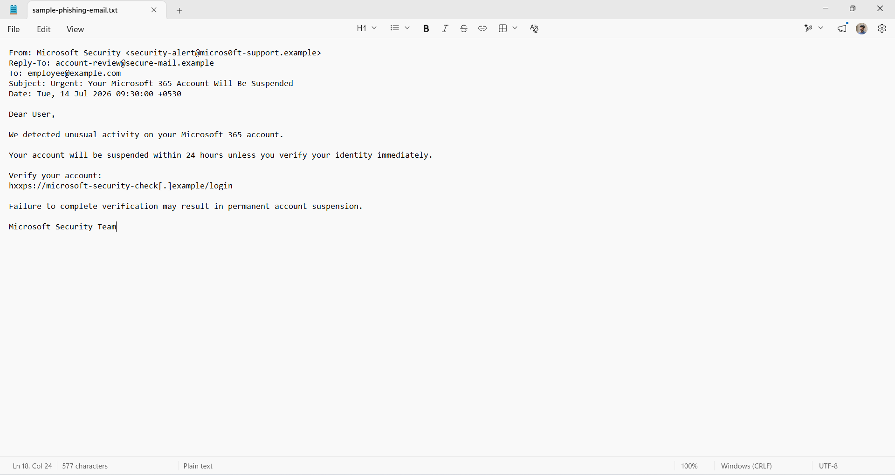
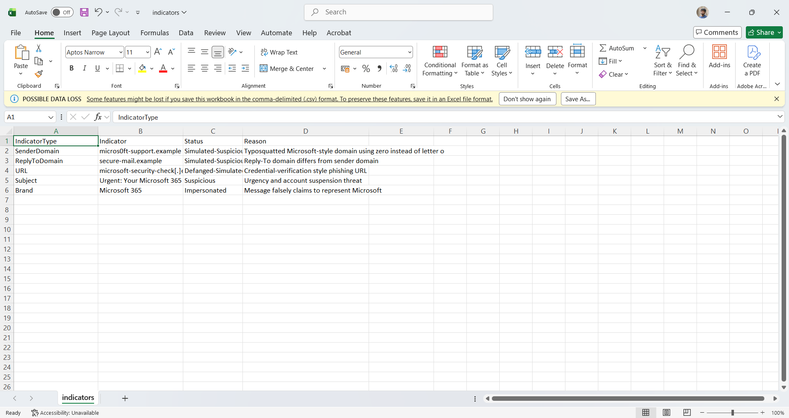
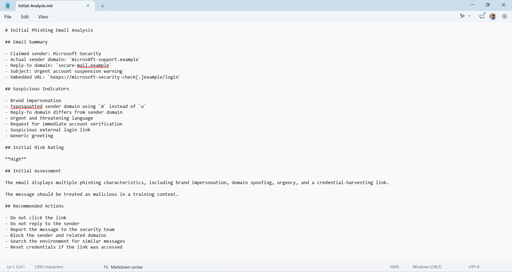

# Phishing Email Investigation

## Overview

This project demonstrates a SOC-style investigation of a simulated phishing email.

The analysis focused on sender validation, domain mismatches, suspicious language, defanged URLs, IOC extraction, risk assessment, MITRE ATT&CK mapping, and recommended response actions.

## Objectives

- Analyse a simulated phishing email
- Identify brand impersonation and typosquatting
- Review sender and Reply-To mismatches
- Extract and document indicators of compromise
- Assess phishing risk
- Map observed behaviour to MITRE ATT&CK
- Document recommended response actions
- Preserve privacy and avoid using live malicious content

## Tools and Methods

- Manual email analysis
- IOC extraction
- Markdown reporting
- CSV documentation
- MITRE ATT&CK mapping
- GitHub
- Defanged URL handling

## Email Summary

| Field | Observation |
|---|---|
| Claimed sender | Microsoft Security |
| Sender domain | `micros0ft-support.example` |
| Reply-To domain | `secure-mail.example` |
| Subject | Urgent Microsoft 365 account suspension warning |
| Embedded URL | `hxxps://microsoft-security-check[.]example/login` |
| Attachment | None |
| Risk rating | High |

## Suspicious Indicators

- Microsoft 365 brand impersonation
- Typosquatted sender domain using `0` instead of `o`
- Reply-To domain differs from sender domain
- Urgent account-suspension language
- Request for immediate account verification
- Suspicious credential-verification link
- Generic greeting
- User interaction required

## IOC Summary

| Indicator Type | Indicator | Assessment |
|---|---|---|
| Sender domain | `micros0ft-support.example` | Simulated suspicious |
| Reply-To domain | `secure-mail.example` | Simulated suspicious |
| URL | `microsoft-security-check[.]example/login` | Defanged simulated indicator |
| Subject | Urgent account suspension warning | Suspicious social-engineering language |
| Brand | Microsoft 365 | Impersonated |

## MITRE ATT&CK Mapping

| Technique ID | Technique | Evidence |
|---|---|---|
| T1566.002 | Phishing: Spearphishing Link | Suspicious verification link embedded in the email |
| T1204.001 | User Execution: Malicious Link | Recipient is encouraged to click the link |

## Risk Assessment

**Overall rating: High**

Potential impact includes:

- Account compromise
- Unauthorised mailbox access
- Credential reuse
- Internal phishing
- Data exposure
- Additional social-engineering attacks

## Recommended Response

- Quarantine the email
- Do not click the link
- Do not reply to the sender
- Block related domains
- Search for similar messages
- Review URL-click telemetry
- Reset credentials if the link was accessed
- Revoke active sessions where compromise is suspected
- Report the incident to the security team

## Repository Structure

```text
phishing-email-investigation
├── Evidence
├── IOCs
│   └── indicators.csv
├── Reports
│   ├── Initial-Analysis.md
│   ├── MITRE-ATTACK-Mapping.md
│   └── Risk-Assessment.md
├── Sample-Email
│   └── sample-phishing-email.txt
├── Screenshots
│   ├── 01-Simulated-Phishing-Email.png
│   ├── 02-IOC-Summary.png
│   └── 03-Initial-Phishing-Analysis.png
├── Tools
├── .gitignore
└── README.md
```

## Screenshots

### Simulated Phishing Email



### IOC Summary



### Initial Phishing Analysis



## Skills Demonstrated

- Phishing email analysis
- IOC extraction
- Email-threat assessment
- Social-engineering analysis
- MITRE ATT&CK mapping
- Security reporting
- Risk assessment
- Safe handling of suspicious content
- Git and GitHub documentation

## Safety Notice

This project uses a simulated phishing email and defanged indicators.

No live malicious URL, credential-harvesting page, or harmful attachment was used.

## Reports

- [Initial Analysis](Reports/Initial-Analysis.md)
- [MITRE ATT&CK Mapping](Reports/MITRE-ATTACK-Mapping.md)
- [Risk Assessment](Reports/Risk-Assessment.md)